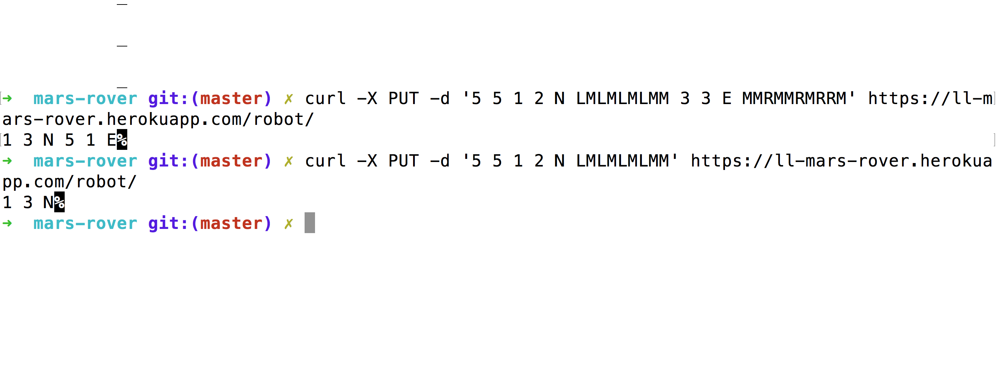
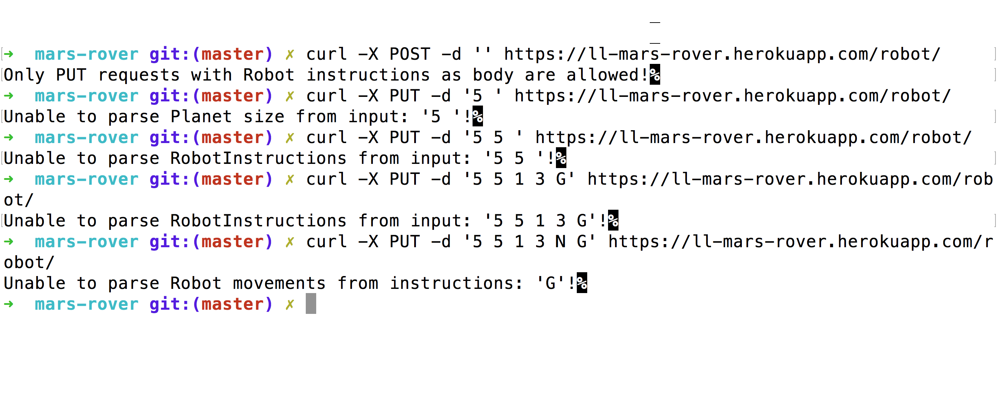

# MarsRover

This application allows you to locally(CLI)/remotely(HTTPS) navigate a Rover
around Mars using sequence of letters and numbers as instructions.

# Usage

## Theoretical Explanation

**INPUT:** The first snippet of input is the upper-right coordinates of the plateau, the lower-left
coordinates are assumed to be 0,0. The rest of the input is information pertaining to the
rovers that have been deployed. Each rover has two snippets of input. The first snippet gives
the rover's position, and the second snippet is a series of instructions telling the rover how to
explore the plateau. The position is made up of two integers and a letter separated by
spaces, corresponding to the x and y coordinates and the rover's orientation. Each rover will
be finished sequentially, which means that the second rover won't start to move until the first
one has finished moving.

**OUTPUT:** The output for each rover should be its final coordinates and heading.

## Example

**Test Input:** 5 5 1 2 N LMLMLMLMM 3 3 E MMRMMRMRRM

**Expected Output:** 1 3 N 5 1 E

## Practical HTTPS remote control using CURL

Copy:

> curl -X PUT -d '5 5 1 2 N LMLMLMLMM 3 3 E MMRMMRMRRM' https://ll-mars-rover.herokuapp.com/robot/

## Validation 

**+ Unit/Functional tests**

# How to deploy

## How to build an executable jar file

> ./gradlew build

Generates an executable JAR file in: ./build/libs/*.jar

## How to run the application

> ./gradlew bootRun

## How to simulate Heroku locally

> heroku local web

## How to deploy to Heroku

> heroku jar:deploy build/libs/mars-rover-http.application.0.1.0.jar --app ll-mars-rover

Deploys the JAR file to a Heroku app called: "ll-mars-rover".

# Tech

## Stack

- Java
- JUnit
- Gradle
- Custom web server using Java's: **com.sun.net.httpserver.HttpServer** package

## Project structure

    .src/main/java/com/marsrover
    ├── controller           # A bridge between outside world and Robot package itself. If it gets decided a different way for robot control, this is the place to change
    ├── coordinates          # Generic Coordinate System using horizontal/vertical points
    ├── http                 # Web server, HTTP controllers
    ├── planet               # All necessary to construct Mars, or other planet
    ├── robot                # Core Robot implementation with clean interface
    ├── Application.java     # MarsRover application
    └── CliApplication.java  # Application adapter for CLI usage
    └── HttpApplication.java # Application adapter for HTTP usage
    
## Extra commentary on design decisions

- Planet's surface (rectangle) is not represented using Array but using simple Coordinate.
which holds 2 integers. This is done because it's more performance wise as only one Rover should
exist in the same time. But how do you know if the Coordinate to step on exists without checking generated grid?
I calculate it in Surface class.
- Rover can move on any surface that implements Robot's SurfacePlan Interface.
- What will happen if Rover gets navigated out of map due to invalid instructions? Rover will reject the move but the error
is saved in case we need to notify the Client controlling it to prevent loosing the Rover like:

(click to play)